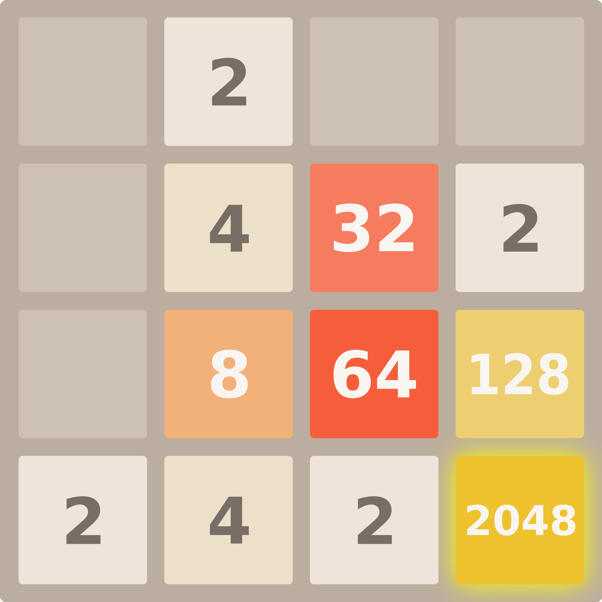

<!-- README template from: https://github.com/othneildrew/Best-README-Template/ -->
<a id="readme-top"></a>

<!-- PROJECT LOGO -->
<br />
<div align="center">
  <a href="https://github.com/JacobNickerson/project-2048">
    
  </a>

<h3 align="center">Project 2048</h3>

  <p align="center">
    A DQN Powered AI Agent for Playing 2048
    <br />
    <a href="https://github.com/JacobNickerson/project-2048"><strong>Explore the docs »</strong></a>
    <br />
    <br />
    <a href="https://youtu.be/ZGJNkrDRDW">View Demo</a>
    &middot;
    <a href="https://github.com/JacobNickerson/project-2048/issues/new?labels=bug&template=bug-report---.md">Report Bug</a>
    &middot;
    <a href="https://github.com/JacobNickerson/project-2048/issues/new?labels=enhancement&template=feature-request---.md">Request Feature</a>
  </p>
</div>


<!-- TABLE OF CONTENTS -->
<details>
  <summary>Table of Contents</summary>
  <ol>
    <li>
      <a href="#about-the-project">About The Project</a>
      <ul>
        <li><a href="#built-with">Built With</a></li>
      </ul>
    </li>
    <li>
      <a href="#getting-started">Getting Started</a>
      <ul>
        <li><a href="#prerequisites">Prerequisites</a></li>
        <li><a href="#installation">Installation</a></li>
      </ul>
    </li>
    <li><a href="#usage">Usage</a></li>
    <li><a href="#roadmap">Roadmap</a></li>
    <li><a href="#contributors">Contributors</a></li>
    <li><a href="#acknowledgments">Acknowledgements</a></li>
    <li><a href="#contact">Contact</a></li>
  </ol>
</details>


<!-- ABOUT THE PROJECT -->
## About The Project

An AI agent using DQN written in Python with Tensorflow.

<p align="right">(<a href="#readme-top">back to top</a>)</p>


### Built With

* [![Python][Python]][Python-url]
* [![Tensorflow][Tensorflow]][Tensorflow-url]
* [![Cpp][Cpp]][Cpp-url]
* [![Boost][Boost]][Boost-url]
* [![Pybind11][Pybind11]][Pybind11-url]

<p align="right">(<a href="#readme-top">back to top</a>)</p>


<!-- GETTING STARTED -->
## Getting Started

### Prerequisites

* cmake
* boost
* pybind11

### Installation

In order to install, compile the required C++ binaries and install python dependencies. I recommend installing python dependencies into a virtual environment, which can be done by using:
```sh
python3 -m venv venv;
source venv/bin/activate;
```
The activation script sourced will depend on which shell you are using.

1. Clone the repo
   ```sh
   git clone https://github.com/JacobNickerson/project-2048.git
   ```
2. Create a build directory
   ```sh
   mkdir build
   ```
3. Generate build scripts
   ```sh
   cd build;
   cmake .. -DCMAKE_BUILD_TYPE=Release -DENABLE_TESTS=OFF -DGENERATE_PY_STUB=ON;
   ```
4. Compile DQNTrainer
   ```sh
   make
   ```
5. Install python dependencies
   ```sh
   cd ../DQNModel;
   pip install -r requirements.txt  # I recommend using a venv
   ```

<p align="right">(<a href="#readme-top">back to top</a>)</p>

<!-- USAGE EXAMPLES -->
## Usage

To train a model, from the DQNModel directory call:
```
python3 train_model.py
```
The training script accepts many parameters, use `--help` to see them. They all have default values, but the environment type, number of environments, model save interval, model file name, etc. can all be configured.
A current limitation for the cpp environment requires it to be launched separately. This can done using `./DQNTrainer <env_count>`. When using the cpp environment, make sure to use the same number of envs as the training script.
The python environment will handle everything automatically, however.

To run an existing model, from the DQNModel directory call:
```
python3 run_model.py
```
The model running script accepts many parameters, use `--help` to see them. It has one required parameter, `--input`, which determines where the inputs come from. The valid options are `network`, `random`, and `user`. If `network`
is chosen, a path must be provided to the models weights. For example:
```
python3 run_model.py --input network --network models/double_dueling_dqn_model/hi_72500224_target.weights.h5
```

<p align="right">(<a href="#readme-top">back to top</a>)</p>


<!-- ROADMAP -->
## Roadmap

- [ ] Reward function tuning
- [ ] Prioritized replay buffer
- [ ] Hyperparameter adjustment
- [ ] CNN

See the [open issues](https://github.com/JacobNickerson/project-2048/issues) for a full list of proposed features (and known issues).

<p align="right">(<a href="#readme-top">back to top</a>)</p>

<!-- CONTRIBUTORS -->
### Contributors:

<a href="https://github.com/JacobNickerson/project-2048/graphs/contributors">
  
</a>

<p align="right">(<a href="#readme-top">back to top</a>)</p>

<!-- ACKNOWLEDGMENTS -->
## Acknowledgments

* [2048](https://github.com/gabrielecirulli/2048) Web environment powered with a modified fork of the original 2048.

<p align="right">(<a href="#readme-top">back to top</a>)</p>

<!-- CONTACT -->
## Contact

Jacob Nickerson - jacobmilesnickerson@gmail.com

Project Link: [https://github.com/JacobNickerson/project-2048](https://github.com/JacobNickerson/project-2048)

<p align="right">(<a href="#readme-top">back to top</a>)</p>

[Python]: https://img.shields.io/badge/Python-3776AB?logo=python&logoColor=fff
[Python-url]: https://www.python.org
[Tensorflow]: https://img.shields.io/badge/TensorFlow-ff8f00?logo=tensorflow&logoColor=white
[Tensorflow-url]: https://www.tensorflow.org
[Cpp]: https://img.shields.io/badge/C++-%2300599C.svg?logo=c%2B%2B&logoColor=white
[Cpp-url]: https://isocpp.org
[Boost]: https://img.shields.io/badge/Boost-blue.svg?logo=boost
[Boost-url]: https://www.boost.org
[Pybind11]: https://img.shields.io/badge/pybind11-%20-blue?logo=pybind11
[Pybind11-url]: https://github.com/pybind/pybind11
